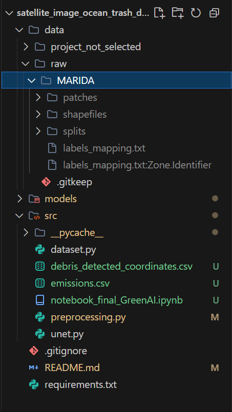

# Ocean Guard - L'Alliance de l'IA et de l'Espace pour la Préservation Marine

## 🌊 Contexte et Vision du Projet

**"Nous fournissons des données, pas des filets."**

La pollution plastique des océans est une crise écologique majeure. Les opérations de nettoyage, comme celles menées par *The Ocean Cleanup*, sont cruciales mais coûteuses et énergivores. Une part significative de leur empreinte carbone et de leur budget provient du carburant utilisé par les navires pour localiser les zones de déchets.

**Notre Mission :** Ocean Guard se positionne comme l'intelligence tactique derrière ces opérations. Notre objectif est d'utiliser l'imagerie satellitaire (Sentinel-2) et l'intelligence artificielle pour détecter précisément les amas de déchets marins et fournir des cartes d'intervention optimisées. En réduisant l'incertitude, nous réduisons les kilomètres parcourus inutilement, et donc l'empreinte carbone du nettoyage lui-même.

### 💡 Évolution du Projet
Le projet a initialement exploré la corrélation entre l'irradiation solaire et la consommation électrique pour optimiser l'installation de panneaux solaires. Bien que méthodologiquement solide, cette piste a été écartée en raison d'une corrélation insuffisante pour justifier une approche par IA complexe. Le projet s'est alors recentré sur la problématique plus impactante de la détection de déchets marins (Green AI).

---

## 🛰️ Données : Le Dataset MARIDA

Nous utilisons le dataset de référence **MARIDA** (Marine Debris Archive), qui comprend des données multispectrales issues des satellites Sentinel-2.

*   **Structure :** Patchs d'images, masques de segmentation annotés, et cartes de confiance.
*   **Classes :** Débris marins, Eau, Écume, Nuages, Navires, etc. (15 classes au total).
*   **Défis :**
    *   Taille minuscule des débris par rapport à la résolution spatiale.
    *   Faux positifs fréquents (écume, vagues, reflets solaires).
    *   Déséquilibre massif des classes (l'eau est majoritaire).

**Installation des Données :**
Les données MARIDA doivent être placées dans le dossier `data/raw/` (non inclus dans le dépôt git).

---

## Méthodologie et Intelligence Artificielle

Notre approche repose sur la segmentation sémantique pour classifier chaque pixel de l'image satellite.

### 1. Prétraitement Avancé
*   **Normalisation :** Adaptation des bandes spectrales.
*   **Gestion des Incertitudes :** Utilisation des cartes de confiance fournies par MARIDA pour ignorer les pixels ambigus lors de l'apprentissage.
*   **Augmentation de Données :** Rotations et flips pour robustifier le modèle face aux variations d'orientation.

### 2. Modèles Développés
*   **U-Net :** Architecture de référence pour la segmentation médicale et satellitaire, efficace pour capturer les détails fins.
*   **ResNet-Segmentation :** Utilisation d'un backbone ResNet34 pré-entraîné pour extraire des caractéristiques plus riches.

### 3. Stratégie d'Entraînement
*   **Weighted Focal Loss :** Une fonction de perte conçue pour forcer le modèle à se concentrer sur les exemples difficiles (les débris) et pénaliser moins les erreurs sur les classes faciles (eau), compensant ainsi le déséquilibre des classes.

---

##  Résultats et Impact

### Performance du Modèle
Notre modèle U-Net a démontré une capacité prometteuse à distinguer les déchets marins des autres éléments (écume, vagues).
*   **Rappel (Débris Marins) :** ~96% (Le modèle ne rate presque aucun débris).
*   **F1-Score (Débris Marins) :** ~0.66.

### Extraction de Coordonnées (Fonctionnalité Clé)
Au-delà de la simple détection visuelle, nous avons développé un module qui **convertit les prédictions du modèle en coordonnées GPS réelles**.
*   **Sortie :** Fichier `debris_detected_coordinates.csv`.
*   **Usage :** Ce fichier peut être directement intégré aux systèmes de navigation des navires de nettoyage.

### Green AI & CodeCarbon
Dans une démarche éco-responsable cohérente avec notre mission, nous avons utilisé la librairie `codecarbon` tout au long du projet pour monitorer l'empreinte CO2 liée à l'entraînement de nos modèles.

---

## 📂 Structure du Projet

```
.
├── data/               # Dossier pour les datasets (MARIDA)
├── notebooks/          # Notebooks d'exploration et de démonstration
├── src/                # Code source principal
│   ├── dataset.py      # Gestion du chargement des données (DataLoaders)
│   ├── preprocessing.py# Fonctions de nettoyage et augmentation
│   ├── unet.py         # Architecture du modèle U-Net
│   └── ...
├── requirements.txt    # Dépendances Python
└── README.md           # Ce fichier
```

## Installation et Utilisation

1.  **Cloner le dépôt :**
    ```bash
    git clone https://github.com/3leopaul/satellite_image_ocean_trash_detector.git
    cd satellite_image_ocean_trash_detector
    ```

2.  **Installer les dépendances :**
    ```bash
    pip install -r requirements.txt
    ```

3.  **Préparer les données :**
    Téléchargez le dataset MARIDA et placez-le dans `data/raw/`.

4.  **Exécuter le Notebook Principal :**
    Ouvrez `src/notebook_final_GreenAI.ipynb` pour voir le pipeline complet, de l'exploration à la détection et l'extraction des coordonnées.

---
